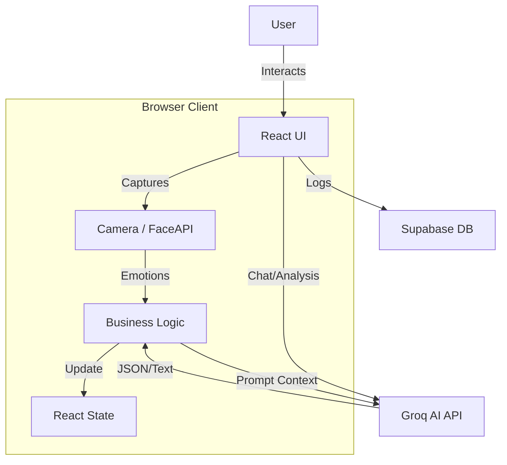

# Evolve Code Wiki 📚

Welcome to the technical documentation for **Evolve**. This wiki explains the internal architecture, data flows, and key algorithms used in the application.

## 🏗️ Architecture Overview

Evolve is a client-side heavy application built with **React** and **Vite**. It uses **Supabase** for persistence and **Groq** for high-speed AI inference.

---

## 🧠 Core Systems

### 1. Emotion Recognition (`utils/emotionAnalyzer.ts`)
We use **face-api.js** (TensorFlow.js) running entirely in the browser.
- **Model**: `tinyFaceDetector` (lightweight, fast) + `faceExpressionNet`.
- **Latency**: ~100ms per frame.
- **Privacy**: No image data is ever sent to a server. Only the *detected emotion labels* (e.g., "happy: 0.9") are stored.

### 2. Suggestion Engine (`utils/suggestionEngine.ts`)
This is the "brain" of the recommendation system.
1.  **Input**: Recent moods + Journal keywords + User interests.
2.  **Profile Building**: Constructs a `GroqUserProfile` object.
3.  **AI Generation**:
    - Calls Groq (`llama-3.3-70b`) with a strict JSON system prompt.
    - Asks for 4 items (Book, Movie, Podcast, Music).
4.  **Fallback Mechanism**:
    - If AI fails or returns empty, we switch to **Heuristic Search**.
    - Queries `recommendationApi.ts` (OMDB, iTunes, OpenLibrary) using keywords from the user's journal.
    - If *those* APIs fail, we return **Curated Content** strings (hardcoded safety net).

### 3. Smart Insights (`services/groq.ts`)
- **Review**: `generateWeeklySummary` takes the last 7 days of mood/journal entries.
- **Analysis**: `generateDeeperAnalysis` looks for patterns (e.g., "Anxious on Mondays").
- **Output**: Returns plain text or JSON depending on the specific function.

---

## 📂 Directory Structure Explained

### `/src`

- **`components/`**: Reusable UI blocks.
    - `ApiDebugStatus.tsx`: Hidden debug tool for API connection testing.
    - `CameraCapture.tsx`: Usage of `react-webcam`.
    - `Chart*.tsx`: wrappers around Recharts.
- **`services/`**: External API clients.
    - `groq.ts`: All LLM interactions. Centralized error handling.
    - `supabase.ts`: Database client instance.
    - `recommendationApi.ts`: Search logic for 3rd party content APIs.
- **`utils/`**: Pure logic helper functions.
    - `emotionAnalyzer.ts`: Face-API loader and inference.
    - `suggestionEngine.ts`: The complex logic bridging User Data <-> Recommendations.
- **`types/`**: TypeScript definitions. Strictly typed interfaces for all data models.

---

## 🔐 Security & Env Variables

We use `.env` to store sensitive keys. This file is **gitignored**.
- `VITE_GROQ_API_KEY`: Critical for AI.
- `VITE_SUPABASE_*`: Required for auth/db.
- `VITE_OMDB_API_KEY`: Optional (falls back to curated list if missing).

---

## 🔄 Key Data Flows

### The "New Suggestion" Flow
1. User clicks "New Suggestions".
2. `SuggestionsPanel.tsx` fetches recent data (Supabase).
3. Calls `suggestionEngine.generateSuggestions()`.
4. Engine checks `Groq` service.
   - **Success**: Returns AI-tailored items.
   - **Failure**: Logs error, calls `recommendationApi.search*` with heuristic keywords.
5. Results are saved to Supabase (`content_suggestions` table) for persistence.
6. UI updates to show new cards.

---

## 🧪 Testing

We rely on **manual verification** scenarios:
1. **Empty State**: New user, no logs. Engine should use "Neutral" profile.
2. **Offline**: If network drops, React Query caches should show previous data.
3. **API Failure**: If Groq is down, Fallback suggestions MUST appear.

---

*This wiki is auto-generated and should be updated when core architecture changes.*
